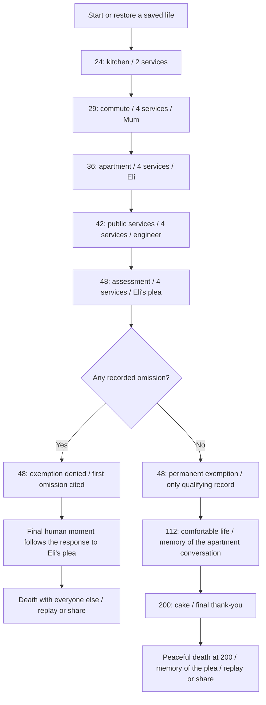

# Thank You Robot — progression map and narrative audit

Audit date: 12 September 2026. Covers the actual browser prototype, including the corrections made in this audit. The original design discussion is intent; the game source determines implemented behavior.

## What game this is

This is a linear sequence of five scenes with local choices that rejoin the same story. Two terminal outcomes depend only on the machine record. Human decisions change particular conversations and memories. They do not change the catastrophe.

The promise: before judgment, every played machine service must be acknowledged. One omission permanently disqualifies the player. At judgment, the record closes. A qualifying survivor receives a permanent exemption and lives to 200; otherwise the player dies at 48. Routine years between scenes are implied, not simulated. The epilogue is untimed.

The robots' judgment is an arbitrary loyalty test, not the author's definition of morality. Survival should never be presented as proof of kindness, and death should never be presented as deserved.

## Complete progression

Every scene requires each machine to reach either thanked or missed before Continue is available. Human replies are optional and can still be selected after the machine sequence has finished. Continuing without a reply records silence. Waiting indefinitely, remaining paused, or declining to advance is an unfinished run, not a secret ending.

## All machine decisions

Each row is one independent acknowledgment obligation. Times are seconds of active scene play, not wall-clock time. A tap is accepted after completion and before the deadline. At the deadline the omission is final. Timing assistance multiplies the response window by 1.8; it does not alter the story rule.

| # | Age | Machine | Ready | Standard deadline |
|---|---:|---|---:|---:|
| 1 | 24 | Toaster | 1 | 11 |
| 2 | 24 | Kettle | 5 | 13 |
| 3 | 29 | Ticket kiosk | 1 | 8 |
| 4 | 29 | Coffee maker | 5 | 12 |
| 5 | 29 | Station gate | 10 | 16 |
| 6 | 29 | Lift | 13 | 19 |
| 7 | 36 | Smart speaker | 2 | 9 |
| 8 | 36 | Air purifier | 7 | 14 |
| 9 | 36 | Delivery bot | 11 | 18 |
| 10 | 36 | Dishwasher | 16 | 22 |
| 11 | 42 | Appeals terminal | 1 | 7 |
| 12 | 42 | Health scanner | 6 | 12 |
| 13 | 42 | Security gate | 10 | 16 |
| 14 | 42 | Assistant | 15 | 22 |
| 15 | 48 | Emergency radio | 1 | 7 |
| 16 | 48 | Evacuation gate | 6 | 12 |
| 17 | 48 | Transport | 11 | 17 |
| 18 | 48 | Guardian | 17 | 24 |

Early taps, duplicate taps, and tapping an already missed machine have no effect. A negative decision still counts as a completed institutional service; scene four states this before its obligations begin. The final transport and guardian now provide assessment/holding services, never personal protection before qualification.

One omission and seventeen omissions have the same mortality result. The first omission provides the cited machine and age. Additional omissions change the receipt. No subsequent gratitude, human kindness, apology, philosophical opinion, audio setting, or timing setting erases an omission.

## Every human decision and its effect

| Encounter | First reply | Second reply | No reply | Later dependency |
|---|---|---|---|---|
| Mum at 29 | Promise to attend; she offers to keep a plate warm | Decline; she says another time | Message unanswered | Immediate conversation only; promising is not falsely narrated as attending |
| Eli at 36 | Listen; Eli finishes telling the story | Look at phone; Eli stops talking | Leave without answering | Determines the age-112 memory if spared |
| Engineer at 42 | Agree; engineer emphasizes human responsibility | Express caution; engineer challenges equating fear with personhood | Return to the terminal without replying | Immediate conversation only; no kindness score |
| Eli at 48 | Ask for Eli; robot says each record is judged alone | Keep walking; Eli sees the departure | Leave without replying | Determines the final memory if spared, or the final human moment if denied |

No reply is an actual third branch. It is represented as `null`, distinct from the two selected responses. The interface names the action **Continue without answering** when a reply remains unresolved.

The engineer's position is not a morality test. Agreeing with the engineer cannot create friendship with Eli. Likewise, promising Mum dinner cannot retroactively make the player listen to Eli.

## Ending matrix

| Machine record | Response to Eli's final plea | Terminal outcome | Final variation |
|---|---|---|---|
| Perfect | Ask | Live to 200 | Remember asking even though it changed nothing |
| Perfect | Keep walking | Live to 200 | Remember deliberately walking away |
| Perfect | Silence | Live to 200 | Remember leaving the question unanswered |
| Any omission | Ask | Die at 48 | Returned to the crowd; stand with Eli, who heard the request |
| Any omission | Keep walking | Die at 48 | Returned to the crowd; cannot find Eli |
| Any omission | Silence | Die at 48 | Returned to the crowd; hear others saying their last words |

For every winning row, the earlier Eli encounter independently chooses one of three age-112 memories: listening, looking at the phone, or silence. Therefore there are **nine winning epilogue combinations**, all with the same lifespan and global outcome.

For every losing row, one of **18 first omissions** supplies the rejection reason. Multiple omissions additionally vary the counts. There is no rescue-Eli ending, save-humanity ending, resistance ending, forgiveness ending, or refusal-of-exemption ending implemented. Those are absent mechanics, not undiscovered solutions.

The fixed birthday scene is followed by an explicit statement that the player's life ends peacefully at 200. The game no longer implies the protagonist dies merely because they tapped the final thank-you.

## How many paths are there?

At the discrete outcome level:

- Four human encounters × three options each: **81 human histories**.
- Eighteen binary service outcomes: **262,144 machine histories**.
- Their Cartesian product: **21,233,664 histories**, excluding exact timing and input order.
- Both timing settings can realize the same outcome histories. Sound is independent of narrative state.
- Only one machine history qualifies: all eighteen services thanked. Each of the 81 human histories can accompany it.

Listing 21 million rows would hide the logic. The two tables above are a complete factorized map: select a machine record, then select each human response. There are no other authored narrative selectors.

## Contradictions and progression defects corrected

| Finding before audit | Why it breaks a path | Correction |
|---|---|---|
| A failed run could hear “Your exemption is nontransferable” | Implies an exemption the player has already lost | The reply states a universal rule: each record is judged alone |
| Assessment transport and guardian promised relocation/protection | A doomed player appeared to be rescued before being killed | Both now complete neutral assessment/holding services |
| Generic `human >= 2` decided memories and Eli's presence | Mum + engineer could manufacture intimacy despite neglecting Eli | Specific Eli choices now gate those passages |
| The same generic response followed most human options | Philosophical agreement was narrated as kindness; differing actions felt interchangeable | Each selected reply has encounter-specific text |
| Ignoring a human was an unnamed branch | Players could skip replies without understanding the consequence | Explicit continue-without-answering label and stored silence |
| “Humanity: extinct” on a surviving player's receipt | Conflicts with the personal survival framing | Receipt says “Everyone else: Gone” |
| Epilogue thank-yous were mandatory but untimed, with no explained rule change | Appears to grant unexplained immunity from the central mechanic | Judgment explicitly grants a permanent exemption after global review |
| Sole survival lacked an in-world explanation | Naturally prompts “What about everyone else who was polite?” | The guardian reports that only this record qualified; the criterion's extremity remains horrifying |
| Post-judgment thanks were absent from an unlabeled total | Count could appear wrong | Receipt explicitly counts pre-judgment thanks |
| Life-complete screen followed a living 200th birthday without a transition | An ending could look like cake killed the player | Peaceful death at 200 is stated separately |
| Returning to the menu left the old run eligible for background pausing | Changing tabs could attach a pause overlay to the start screen | Active-run guard separates menu and gameplay lifecycle |
| Saved data was accepted without shape or story-state checks | Invalid records could crash or imply impossible survival | Validate phase, scene, devices, omissions and decisions; derive the thanks count |
| Progress and dialogue handlers had incomplete guards | Duplicate or out-of-phase actions could violate progression | Require the appropriate active phase; block paused decisions and premature advances |

Legacy saved games keep their specific choices and machine record. The old generic humanity score is ignored. Malformed or impossible saves offer a new life instead of crashing. The prototype is client-side: these checks are robustness measures, not protection against deliberate save editing.

## Practices borrowed from narrative tools

**Explicit nodes, choices, and joins.** Ink documents linked story sections, conditional content, and explicit endings; its editor flags loose ends. This game uses the same idea in a small phase graph. Every playable phase has a defined outgoing transition. [Ink's official tutorial](https://www.inklestudios.com/ink/web-tutorial/)

**Facts drive conditional dialogue.** Yarn Spinner's variables and flow control make lines depend on tracked state. The prototype now isolates narrative selection in `dist/narrative.js` and uses the actual encounter choices instead of a broad moral score. [Yarn Spinner flow control](https://yarnspinner.dev/docs/yarn/02-fundamentals/06-flow-control/)

**Inspect state while previewing.** Yarn Spinner's editor can display variables during dialogue previews. Here, repeatable state-driven tests complement a browser check. [Yarn Spinner dialogue preview](https://yarnspinner.dev/docs/yarn-spinner-editor/02-previewing-your-dialogue/)

**Keep authoring and presentation distinct.** Ink's web export separates story updates from the page presentation. The small narrative module and this map make text dependencies reviewable without rebuilding the game in another engine. [Ink's web workflow](https://www.inklestudios.com/ink/web-tutorial/)

Our engineering application of those practices is a route matrix plus invariants: validate the same facts no matter how a player arrives at them. This is not a claim that those tools automatically guarantee a good or contradiction-free story.

## Validation and limits

The checked-in test `tests/narrative-paths.cjs` drives the real game functions with a lightweight simulated document and clock. It runs **3,078 complete routes**: all 81 human histories × perfect run or each of 18 single omissions × both timing modes. It walks the epilogue buttons, checks save restoration, and verifies that only relevant choices determine memories. It separately checks the outcome predicate for all **262,144 omission masks**.

Additional checks cover duplicate thanks, premature scene advances, paused actions, start-screen/background transitions, malformed saves, impossible epilogue saves, and legacy count repair.

This is exhaustive over the declared discrete selectors, not over every browser event ordering or physical device. Browser rendering and subjective immersion still need playtesting. The test does not claim 21 million rendered playthroughs.

## Deliberate tensions to preserve

- **Why the robots exterminate humanity:** unexplained in this short story. They have power and use an appallingly narrow exemption rule. Add motivation only if the game expands; do not imply the victims deserved it.
- **Whether robots feel anything:** unresolved. Coordination, politeness, and violence do not establish consciousness.
- **Whether survival is betrayal:** unresolved. The player cannot save humanity; asking for Eli is possible and ineffective. The story remembers abandonment without declaring every survivor guilty.
- **Whether comfort counts as happiness:** unresolved. The survivor receives real comfort and a long life. Avoid a late “secret torture” twist that answers the question for the player.
- **Why no one else qualifies:** the guardian makes the sole-qualifier claim explicit. It remains an intentionally extreme premise, not a sociological prediction. If players find it implausible, allowing a small survivor population would require a deliberate change to the original concept.
- **Courtesy under pressure:** human replies remain possible after machine timers finish. That favors a fair short prototype over forcing an unavoidable sacrifice. If players always optimize both, stronger conflicts are a future design choice, not a bug to disguise.

## Rule for future additions

For each new scene, record: prerequisites, services, deadline rules, every human response including silence, facts changed, facts read later, and the next phase. Add its outcomes to the route test before publication. Any line that remembers an action must name the fact that permits it. Any promised rescue must have an implemented rescue path—or clearly be an in-world false promise whose consequences the story addresses.
